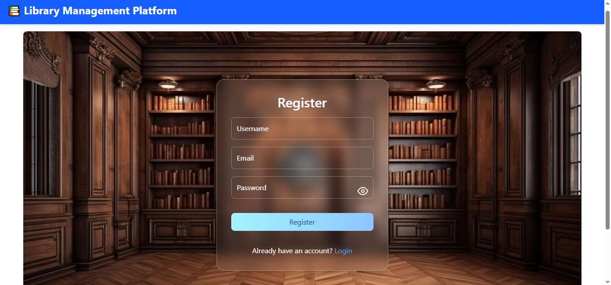
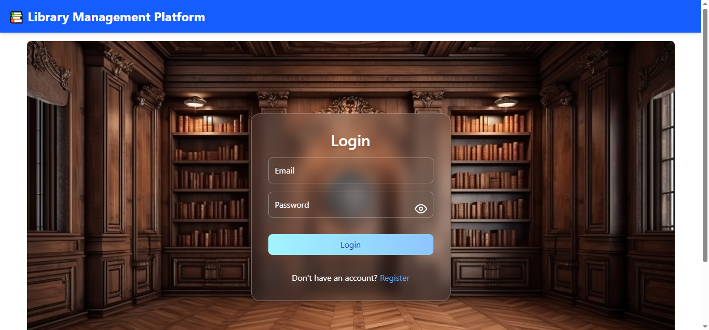
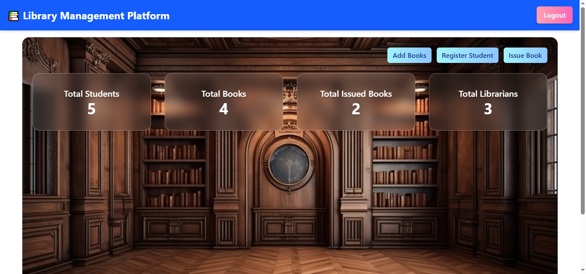
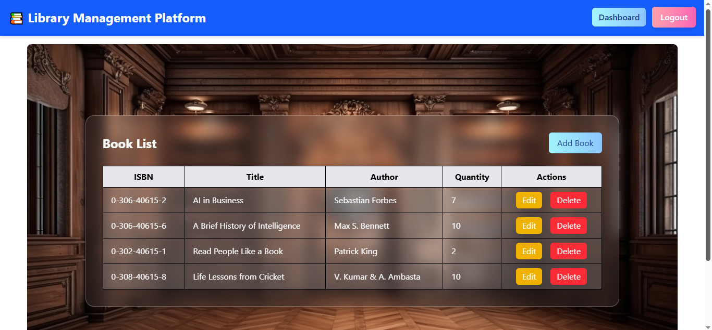
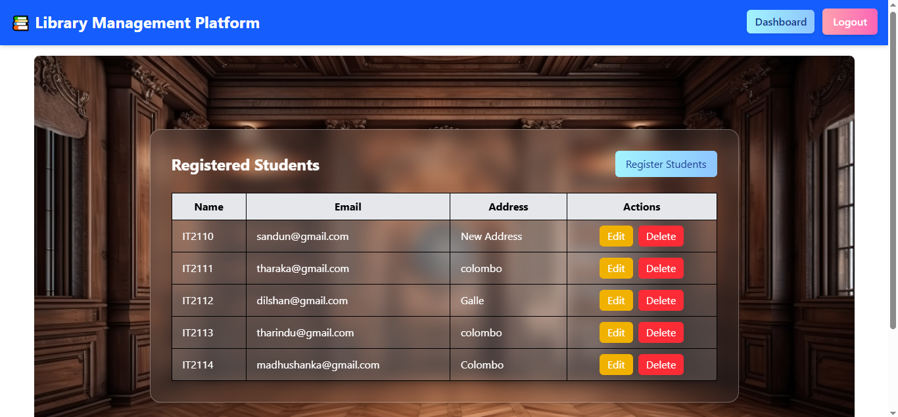
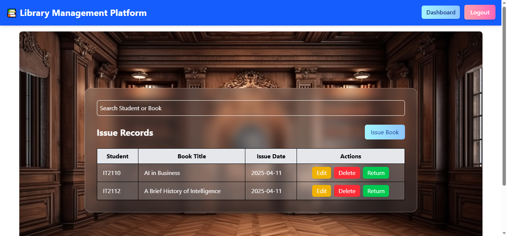

# 📚 Library Management Platform (React + ASP.NET Core)

A simple web-based Library Management System built with **React**, **Tailwind CSS**, and **ASP.NET Core Web API**. The app includes user authentication, book management, student registration, and book issuing features.

## 🚀 Features

- 🔐 User authentication
- 📘 Add and manage books
- 🧑‍🎓 Register students
- 📤 Issue books to students
- 🖥️ Dashboard with overview
- 💨 Stylish UI with Tailwind CSS

## 🛠️ Tech Stack

- **Frontend**: React, Tailwind CSS  
- **Backend**: ASP.NET Core Web API with Entity Framework Core  
- **Database**: SQL Server

## 📸 Screenshots

- 📷 **Login Page**  
  

- 📷 **Register Page**  
  

- 📷 **Dashboard**  
  

- 📷 **Add Book**  
  

- 📷 **Register Student**  
  

- 📷 **Issue Book**  
  
